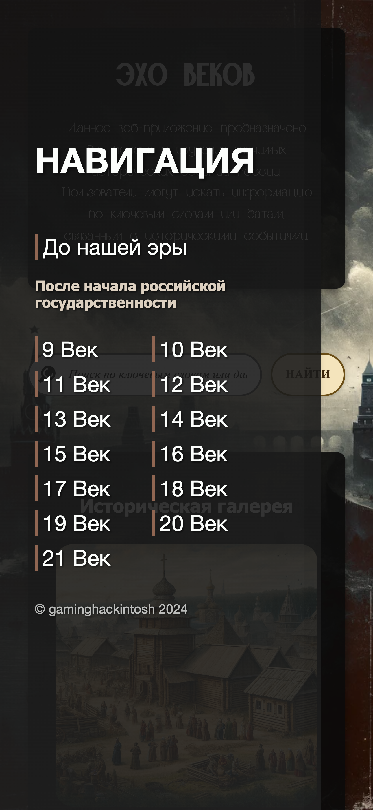

# Эхо веков : Веб-Приложение

## Описание

Данное веб-приложение предназначено для поиска и изучения значимых исторических событий России. Пользователи могут искать информацию по ключевым словам или датам, связанным с историческими событиями.

## Функциональность

- Поиск по ключевым словам: введите ключевое слово или фразу, чтобы найти события, связанные с этими терминами.
- Поиск по дате: введите интересующую вас дату, чтобы узнать, какие события произошли в этот день.

## Технологии

Проект реализован с использованием следующих технологий:

- HTML5
- CSS3
- JavaScript

## Структура проекта

- HistoryApp/
  - assets/
    - JS/
      - main.js — основной файл JavaScript, содержащий логику веб-приложения.
      - collage.js - файл содержащий логику Коллажа.
      - sidebar.js - файл содержащий логику Сайдбара.
    - CSS/
      - reset.css — сброс стандартных стилей браузера для обеспечения одинакового внешнего вида на всех платформах.
      - font.css — настройки пользовательских шрифтов, используемых в приложении.
      - main.css — основной стилевой файл, определяющий глобальные стилистические параметры интерфейса приложения.
      - adaptation.css — адаптивные стили для корректного отображения веб-приложения на различных устройствах, от мобильных телефонов до больших экранов.
      - sidebar.css — стили для боковой панели навигации, включая визуальное оформление и анимации.
    - Photo/ - папка содержащая фото которые находятся на сайте
    - fonts/ - папка содержащая сторонние шрифты которые находятся на сайте
    - data.json — файл данных, содержащий исторические события в формате JSON.
  - index.html — главный файл разметки, который представляет собой входную точку веб-приложения.

## Запуск проекта

Чтобы запустить проект локально, необходимо:

1. Клонировать репозиторий на свой компьютер.

- 1.1. Открыть файл `index.html` в браузере.

ИЛИ

2. [Перейти по ссылке](https://gaminghackintosh.github.io/HistoryApp-Web-Version/)

## Вклад в проект

Если вы хотите внести свой вклад в проект, пожалуйста, сначала обсудите изменения, которые вы хотите внести, через issues.

## Лицензия

Проект распространяется под лицензией MIT. Смотрите файл `LICENSE` для более подробной информации.

## Контакты

Если у вас есть вопросы или предложения, пожалуйста, свяжитесь со мной через ***Issues*** .

## Благодарности

Благодарим всех, кто внесет вклад в разработку и поддержку этого проекта.

